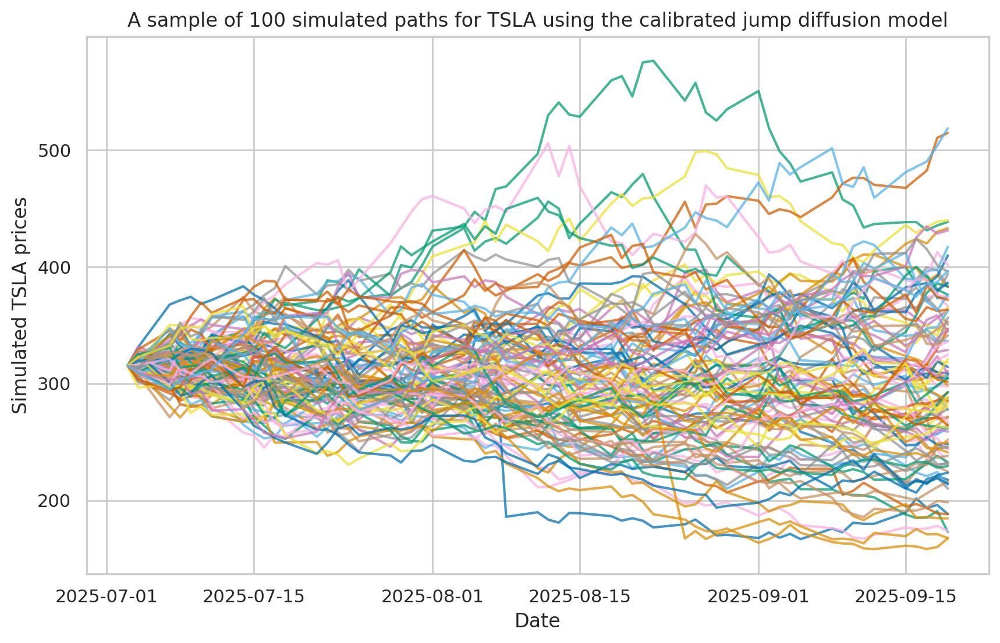
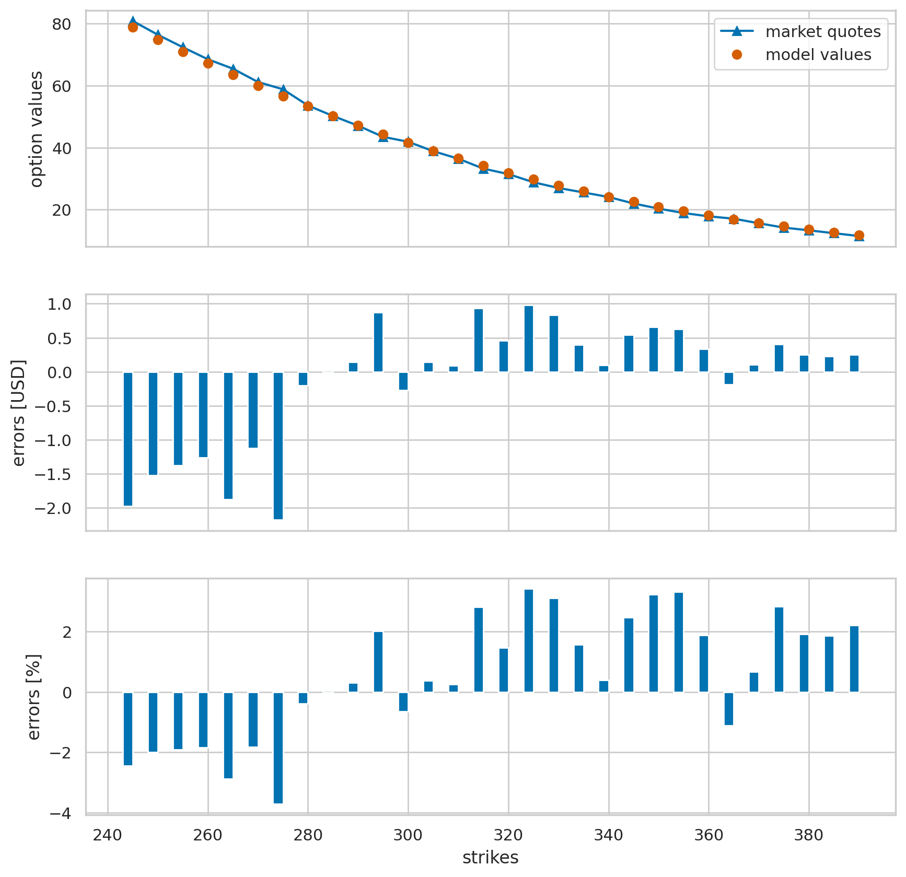

# Derivative_Portfolio_valuation_using_option_chain_data
# Project description and objectives:

This study involves the market-based valuation of a portfolio of non-traded American options on the Tesla (TSLA) stock. The option chain data used in the end-to-end project was sourced from Yahoo Finance.  

The main highlights of this project involve:
1. Calibrating our model to market quotes of liquidly traded options.
2. The model used for simulation was a jump-diffusion model, given by:

$$S_{t_{m+1}} = \Big(exp\Big(\Big(r - r_j - \frac{\sigma^2}{2}\Big)(t_{m+1} - t_{m}) + \sigma\sqrt{t_{m+1} - t_{m}}z_{t}^{1}\Big) + \Big(exp(\mu_{j} + \sigma z_{t}^{2}) - 1\Big)y_t\Big) \\ 0 \le t_m \le t_{m+1} \le T$$

The subsequent diagram illustrates a sample of 100 simulated paths for TSLA stock, derived from calibrated model parameters:

3. Using the calibrated model for the pricing of a portfolio of non-traded American put options using Least Squares Monte Carlo.
4. Calculating the overall portfolio value, as well as risk metrics such as delta and vega.

# Conclusion and recommendations...

In this project, we calibrated our model using liquidly traded options on TSLA stock to evaluate a portfolio of American put options on TSLA, which expires on September 19, 2025. The model's option values aligned closely with market quotes, as demonstrated by minimal errors measured by the mean squared error (MSE), proving that our model was well-calibrated. 

We then employed the model to assess a portfolio of non-traded American options on TSLA stock. Additionally, we computed risk metrics such as the portfolio's delta and vega for effective risk management.
